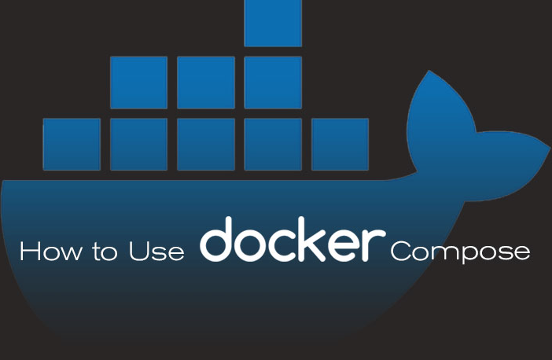

# dockerstuff - A Collection of sample Docker Compose files.

@Jerry Bopara :+1: Hey !! Docker Compose :) :shipit:

> A List of Docker Compose & .env samples - 

These samples provide a statrting point for - How to integrate & setup different services & applications using docker-compose and custom .env's. 

- Clone the repository OR just download the required folder. 
- Each folder contains the instructions of its service/application setup. 
- Each folder having docker-compose.yml and sample_.env. 
- Further setup instructions are given in folder indivisual README.md. 

## Samples of Docker Compose applications with multiple integrated services - 

- [`WordPress / MySQL / MariaDB`](https://github.com/jerrybopara/dockerstuff/tree/main/wordpress-mysql-mariadb) - Sample WordPress application with MySql/MariaDB server databases.
- [`PHP74 + Apache2.4`](https://github.com/jerrybopara/dockerstuff/tree/main/php7.4-apache2) - Web Server - PHP, Apache.

<!--lint disable awesome-toc-->
## Getting started

These Settings will walk you through the basic journey of setting up applications and different services in containerized environment.

### Prerequisites

- Make sure that you have Docker and Docker Compose installed
  - Windows or macOS:
    [Install Docker Desktop](https://www.docker.com/get-started)
  - Linux: [Install Docker](https://www.docker.com/get-started) and then
    [Docker Compose](https://github.com/docker/compose)

- Download some or all of the samples from this repository.
  (https://github.com/jerrybopara/dockerstuff)